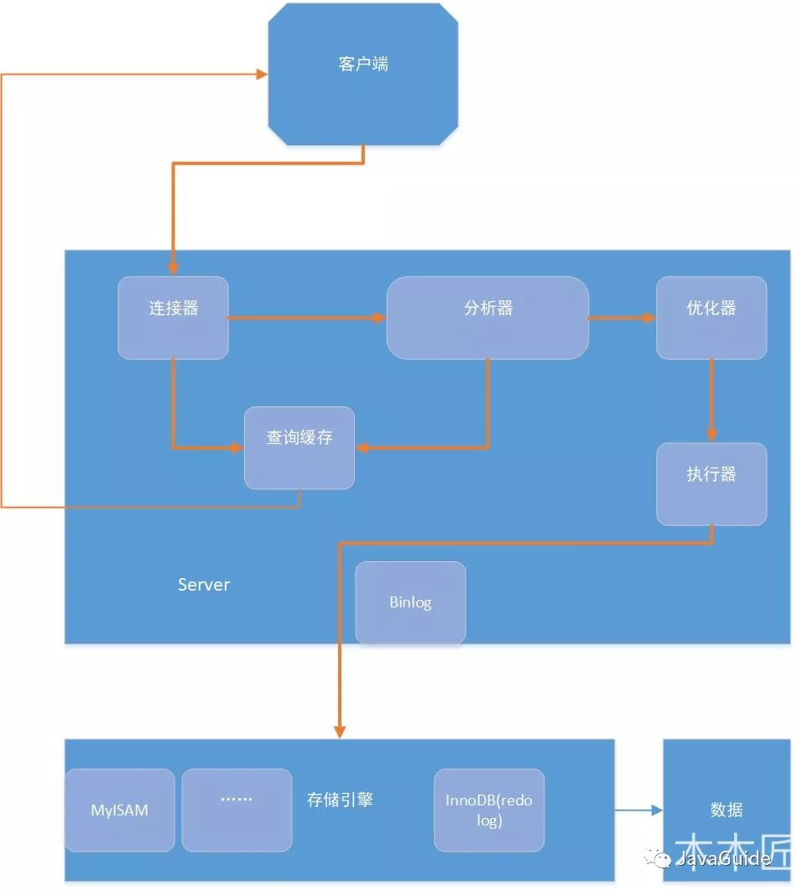

<!-- TOC -->

- [1. MySQL关系型数据库](#1-mysql关系型数据库)
    - [1.1. MyISAM和InnoDB区别](#11-myisam和innodb区别)
        - [1.1.1. MyISAM](#111-myisam)
        - [1.1.2. InnoDB](#112-innodb)
    - [1.2. 字符集及校对](#12-字符集及校对)
    - [1.3. 索引](#13-索引)
    - [1.4. 查询缓存使用](#14-查询缓存使用)
    - [1.5. 事务](#15-事务)
        - [1.5.1. 事务特性ACID](#151-事务特性acid)
            - [1.5.1.1. 原子性](#1511-原子性)
            - [1.5.1.2. 一致性](#1512-一致性)
            - [1.5.1.3. 隔离性](#1513-隔离性)
            - [1.5.1.4. 持久性](#1514-持久性)
        - [1.5.2. 并发事务问题](#152-并发事务问题)
        - [1.5.3. 事务隔离级别有哪些?MySQL的默认隔离级别是?](#153-事务隔离级别有哪些mysql的默认隔离级别是)
    - [1.6. 锁机制与InnoDB锁算法](#16-锁机制与innodb锁算法)
    - [1.7. 大表优化](#17-大表优化)
        - [1.7.1. 限定数据范围](#171-限定数据范围)
        - [读写分离](#读写分离)
        - [垂直分区](#垂直分区)
        - [水平分区](#水平分区)
        - [分库分表后主键ID](#分库分表后主键id)
    - [池化设计思想。数据库连接池](#池化设计思想数据库连接池)
        - [池化设计](#池化设计)
        - [数据库连接池](#数据库连接池)
    - [一条SQL语句在MySQL中如何执行的](#一条sql语句在mysql中如何执行的)
        - [查询语句](#查询语句)
        - [更新语句](#更新语句)
- [MySQL高性能优化建议](#mysql高性能优化建议)
- [一条SQL语句执行慢原因有哪些](#一条sql语句执行慢原因有哪些)

<!-- /TOC -->
# 1. MySQL关系型数据库
默认端口**3306**

## 1.1. MyISAM和InnoDB区别
### 1.1.1. MyISAM
- 只有表级锁，不支持行级锁
- 强调性能，每次查询具有原子性，执行速度比InnoDB快
- 不提供事务
- 不支持外键
- 不支持MVCC
### 1.1.2. InnoDB
- 支持行级锁和表级锁
- 支持事务，具有事务(commit)、回滚(rollback)和崩溃修复能力(crash recovery capabilities)的事务安全(transaction-safe (ACID compliant))型表。
- 支持外键
- [MySQL-InnoDB-MVCC多版本并发控制](https://segmentfault.com/a/1190000012650596)
- 聚簇索引

## 1.2. 字符集及校对
utf-8
## 1.3. 索引
B+树和哈希索引

InnoDB：

其数据文件本身就是索引文件。相比MyISAM，索引文件和数据文件是分离的，其表数据文件本身就是按B+Tree组织的一个索引结构，树的叶节点data域保存了完整的数据记录。这个索引的key是数据表的主键，因此InnoDB表数据文件本身就是主索引。这被称为“聚簇索引（或聚集索引）”。而其余的索引都作为辅助索引，辅助索引的data域存储相应记录主键的值而不是地址，这也是和MyISAM不同的地方。在根据主索引搜索时，直接找到key所在的节点即可取出数据；在根据辅助索引查找时，则需要先取出主键的值，再走一遍主索引。 因此，在设计表的时候，不建议使用过长的字段作为主键，也不建议使用非单调的字段作为主键，这样会造成主索引频繁分裂。 

## 1.4. 查询缓存使用
    查询语句的时候会先查询缓存，MySQL8.0版本已删除

缓存建立之后，MySQL的查询缓存系统会跟踪查询中涉及的每张表，如果这些表（数据或结构）发生变化，那么和这张表相关的所有缓存数据都将失效。

## 1.5. 事务
* 事务是指逻辑上一组操作，要么全部执行，要么全部不执行。
### 1.5.1. 事务特性ACID
#### 1.5.1.1. 原子性
#### 1.5.1.2. 一致性
多个事务对同一个数据读取结果一样
#### 1.5.1.3. 隔离性
并发事务之间是隔离的，不会互相干扰
#### 1.5.1.4. 持久性
事务提交后，对数据的改变是永久的，即使数据库发生故障也应该被持久化下来
### 1.5.2. 并发事务问题
- 脏读
- 丢失修改
- 数据不一致

### 1.5.3. 事务隔离级别有哪些?MySQL的默认隔离级别是?
- READ-UNCOMMITTED(读取未提交)： 最低的隔离级别，允许读取尚未提交的数据变更，可能会导致脏读、幻读或不可重复读。
- READ-COMMITTED(读取已提交)： 允许读取并发事务已经提交的数据，可以阻止脏读，但是幻读或不可重复读仍有可能发生。
- REPEATABLE-READ(可重复读)： 对同一字段的多次读取结果都是一致的，除非数据是被本身事务自己所修改，可以阻止脏读和不可重复读，但幻读仍有可能发生。
- SERIALIZABLE(可串行化)： 最高的隔离级别，完全服从ACID的隔离级别。所有的事务依次逐个执行，这样事务之间就完全不可能产生干扰，也就是说，该级别可以防止脏读、不可重复读以及幻读。

MySQL InnoDB默认是**REPEATABLE-READ(可重复读)**

InnoDB 存储引擎在 分布式事务 的情况下一般会用到 SERIALIZABLE(可串行化) 隔离级别。

## 1.6. 锁机制与InnoDB锁算法
InnoDB默认行级锁

## 1.7. 大表优化
### 1.7.1. 限定数据范围
禁止不带任何；限制数据范围条件饿查询语句
### 读写分离
数据库拆分，主库负责写，从库负责读
### 垂直分区

### 水平分区
保护数据表结构不变，存储数据分片分表

水平拆分 --> 分库
### 分库分表后主键ID
- UUID
- 不同数据库不同步长的ID自增
- 使用Redis生成ID
- 美团的Leaf分布式ID生成系统
## 池化设计思想。数据库连接池
### 池化设计
预先准别好资源，节省掉每次获取资源的消耗，比如创建线程的开销、获取远程连接的开销。
### 数据库连接池
数据库连接本质就是一个 socket 的连接。数据库服务端还要维护一些缓存和用户权限信息之类的 所以占用了一些内存。我们可以把数据库连接池是看做是维护的数据库连接的缓存，以便将来需要对数据库的请求时可以重用这些连接。为每个用户打开和维护数据库连接，尤其是对动态数据库驱动的网站应用程序的请求，既昂贵又浪费资源。

**在连接池中，创建连接后，将其放置在池中，并再次使用它，因此不必建立新的连接。如果使用了所有连接，则会建立一个新连接并将其添加到池中。**

连接池还减少了用户必须等待建立与数据库的连接的时间。

## 一条SQL语句在MySQL中如何执行的
[一条SQL语句在MySQL中如何执行的](https://mp.weixin.qq.com/s?__biz=Mzg2OTA0Njk0OA==&mid=2247485097&idx=1&sn=84c89da477b1338bdf3e9fcd65514ac1&chksm=cea24962f9d5c074d8d3ff1ab04ee8f0d6486e3d015cfd783503685986485c11738ccb542ba7&token=79317275&lang=zh_CN#rd)

- Server层：
包括连接器、分析器、查询缓存、优化器、执行器、binlog日志
- 存储引擎：
负责数据存储和读取，如InnoDB、MyISAM，其中InnoDB自带redolog日志
### 查询语句
### 更新语句
# MySQL高性能优化建议
[MySQL高性能优化规范建议](https://mp.weixin.qq.com/s?__biz=Mzg2OTA0Njk0OA==&mid=2247485117&idx=1&sn=92361755b7c3de488b415ec4c5f46d73&chksm=cea24976f9d5c060babe50c3747616cce63df5d50947903a262704988143c2eeb4069ae45420&token=79317275&lang=zh_CN#rd)

阿里巴巴开发规范

# 一条SQL语句执行慢原因有哪些
[腾讯面试：一条SQL语句执行得很慢的原因有哪些？---不看后悔系列](https://mp.weixin.qq.com/s?__biz=Mzg2OTA0Njk0OA==&mid=2247485185&idx=1&sn=66ef08b4ab6af5757792223a83fc0d45&chksm=cea248caf9d5c1dc72ec8a281ec16aa3ec3e8066dbb252e27362438a26c33fbe842b0e0adf47&token=79317275&lang=zh_CN#rd)