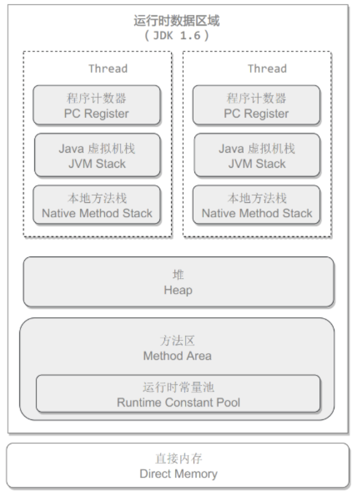

<!-- TOC -->

- [1. JVM数据结构](#1-jvm数据结构)
    - [1.1. 程序计数器](#11-程序计数器)
    - [1.2. Java虚拟机栈](#12-java虚拟机栈)
    - [1.3. 本地方法栈](#13-本地方法栈)
    - [1.4. 堆](#14-堆)
    - [1.5. 方法区（JVM 1.8之后由元空间替代）](#15-方法区jvm-18之后由元空间替代)
    - [1.6. 运行时常量池（1.8后移到堆中）](#16-运行时常量池18后移到堆中)
    - [1.7. 直接内存](#17-直接内存)
- [2. 垃圾收集GC](#2-垃圾收集gc)
    - [2.1. 判断对象是否可被回收](#21-判断对象是否可被回收)
        - [2.1.1. 引用计数算法](#211-引用计数算法)
        - [2.1.2. 对象可达性分析](#212-对象可达性分析)
        - [2.1.3. 方法区回收](#213-方法区回收)
        - [2.1.4. finalize()](#214-finalize)
    - [2.2. 引用类型](#22-引用类型)
    - [2.3. 垃圾收集算法](#23-垃圾收集算法)
        - [2.3.1. 标记-清除](#231-标记-清除)
        - [2.3.2. 标记-整理](#232-标记-整理)
        - [2.3.3. 复制](#233-复制)
        - [2.3.4. 分代收集](#234-分代收集)
    - [2.4. 垃圾收集器](#24-垃圾收集器)
        - [2.4.1. G1收集器](#241-g1收集器)
- [3. 内存分配与回收策略](#3-内存分配与回收策略)
    - [3.1. Minor GC和Full GC](#31-minor-gc和full-gc)
    - [3.2. 内存分配策略](#32-内存分配策略)
- [4. 类加载机制](#4-类加载机制)
    - [4.1. 类的生命周期](#41-类的生命周期)
    - [4.2. 类加载过程](#42-类加载过程)

<!-- /TOC -->
# 1. JVM数据结构


## 1.1. 程序计数器
线程独占隔离，记录正在执行JVM字节码指令的地址。
## 1.2. Java虚拟机栈
线程独占隔离，每个 Java 方法在执行的同时会创建一个栈帧用于存储局部变量表、操作数栈、常量池引用等信息。从方法调用直至执行完成的过程，对应着一个栈帧在 Java 虚拟机栈中入栈和出栈的过程。

可以通过 -Xss来调借Java虚拟机栈内存大小，目前默认为1M：
```
java -Xss2M
```

可能抛出异常：
- StackOverflowError：线程请求的栈深度大于虚拟机所允许的深度。
- OutOfMemoryError：如果虚拟机栈可以动态扩展，而扩展时无法申请到足够的内存。

## 1.3. 本地方法栈
虚拟机使用到的Native方法

一般方法都是用C、C++或汇编语言等编写，被JNI编译使用
可能抛出异常：
- StackOverflowError
- OutOfMemoryError
## 1.4. 堆
所有对象都在这里分配内存，是垃圾收集的主要区域（"GC 堆"）。

现代的垃圾收集器基本都是采用分代收集算法，其主要的思想是针对不同类型的对象采取不同的垃圾回收算法。可以将堆分成两块：

- 新生代（Young Generation）
- 老年代（Old Generation）

堆不需要连续内存，并且可以动态增加其内存，增加失败会抛出 OutOfMemoryError 异常。

可以通过 -Xms 和 -Xmx 这两个虚拟机参数来指定一个程序的堆内存大小，第一个参数设置初始值，第二个参数设置最大值。
```
java -Xms1M -Xmx2M
```
## 1.5. 方法区（JVM 1.8之后由元空间替代）
用于存放已被加载的类信息、常量、静态变量、即时编译器编译后的代码等数据。

和堆一样不需要连续的内存，并且可以动态扩展，动态扩展失败一样会抛出 OutOfMemoryError 异常。

对这块区域进行垃圾回收的主要目标是对常量池的回收和对类的卸载，但是一般比较难实现。

HotSpot 虚拟机把它当成永久代来进行垃圾回收。但很难确定永久代的大小，因为它受到很多因素影响，并且每次 Full GC 之后永久代的大小都会改变，所以经常会抛出 OutOfMemoryError 异常。为了更容易管理方法区，从 JDK 1.8 开始，移除永久代，并把方法区移至元空间，它位于**本地内存**中，而不是虚拟机内存中。

方法区是一个 JVM 规范，永久代与元空间都是其一种实现方式。在 JDK 1.8 之后，原来永久代的数据被分到了堆和元空间中。元空间存储类的元信息，静态变量和常量池等放入堆中。

## 1.6. 运行时常量池（1.8后移到堆中）
运行时常量池是方法区的一部分。

Class 文件中的常量池（编译器生成的字面量和符号引用）会在类加载后被放入这个区域。

除了在编译期生成的常量，还允许动态生成，例如 String 类的 intern()。

## 1.7. 直接内存
在 JDK 1.4 中新引入了 NIO 类，它可以使用 Native 函数库直接分配堆外内存，然后通过 Java 堆里的 DirectByteBuffer 对象作为这块内存的引用进行操作。这样能在一些场景中显著提高性能，因为避免了在堆内存和堆外内存来回拷贝数据。

# 2. 垃圾收集GC
GC主要针对堆和方法区进行的。

线程私有的程序计数器、JVM虚拟机栈和本地方法栈，只存在于线程的生命周期中，线程结束后随之消失，所以不需要进行垃圾回收。
## 2.1. 判断对象是否可被回收
### 2.1.1. 引用计数算法
基本原理是：
为对象添加一个引用计数器，当对象增加一个引用时计数器加 1，引用失效时计数器减 1。引用计数为 0 的对象可被回收。

但是如果出现两个对象互相循环引用，引用计数器永远不为0，这种算法就无法对它们进行回收，所以JVM GC不使用这种算法。

### 2.1.2. 对象可达性分析
以 GC Roots 为起始点进行搜索，可达的对象都是存活的，不可达的对象可被回收。

### 2.1.3. 方法区回收
因为方法区主要存放永久代对象，而永久代对象的回收率比新生代低很多，所以在方法区上进行回收性价比不高。

主要是对**常量池的回收**和对**类的卸载**。

为了避免内存溢出，在大量使用反射和动态代理的场景都需要虚拟机具备类卸载功能。

类的卸载条件很多，需要满足以下三个条件，并且满足了条件也不一定会被卸载：

该类所有的实例都已经被回收，此时堆中不存在该类的任何实例。
加载该类的 ClassLoader 已经被回收。
该类对应的 Class 对象没有在任何地方被引用，也就无法在任何地方通过反射访问该类方法。
### 2.1.4. finalize()
## 2.2. 引用类型
无论是通过引用计数算法判断对象的引用数量，还是通过可达性分析算法判断对象是否可达，判定对象是否可被回收都与引用有关。
- 强引用
强引用关联的对象不会被回收

- 软引用
被软引用关联的对象只有在内存不够的情况才会被回收

使用SoftReference来创建软引用

- 弱引用

被弱引用关联的对象一定会被回收，也就是说它只能存活到下一次垃圾回收发生之前。

使用 WeakReference 类来创建弱引用。
- 虚引用

又称为幽灵引用或者幻影引用，一个对象是否有虚引用的存在，不会对其生存时间造成影响，也无法通过虚引用得到一个对象。

为一个对象设置虚引用的唯一目的是能在这个对象被回收时收到一个系统通知。

使用 PhantomReference 来创建虚引用。
## 2.3. 垃圾收集算法
### 2.3.1. 标记-清除
### 2.3.2. 标记-整理
### 2.3.3. 复制
### 2.3.4. 分代收集
- 新生代使用：复制算法
- 老年代使用：标记 - 清除 或者 标记 - 整理 算法
## 2.4. 垃圾收集器


### 2.4.1. G1收集器
G1（Garbage-First）


# 3. 内存分配与回收策略
## 3.1. Minor GC和Full GC
- Minor GC

`
回收新生代，因为新生代对象存活时间很短，因此 Minor GC 会频繁执行，执行的速度一般也会比较快。
`
- Full GC

`
回收老年代和新生代，老年代对象其存活时间长，因此 Full GC 很少执行，执行速度会比 Minor GC 慢很多。
`
## 3.2. 内存分配策略

# 4. 类加载机制
类是在运行期间第一次使用时动态加载的，而不是一次性加载所有类。因为如果一次性加载，那么会占用很多的内存。
## 4.1. 类的生命周期
- **加载（Loading）**
- **验证（Verification）**
- **准备（Preparation）**
- **解析（Resolution）**
- **初始化（Initialization）**
- 使用（Using）
- 卸载（Unloading）
## 4.2. 类加载过程
包含了加载、验证、准备、解析和初始化这5个阶段。

