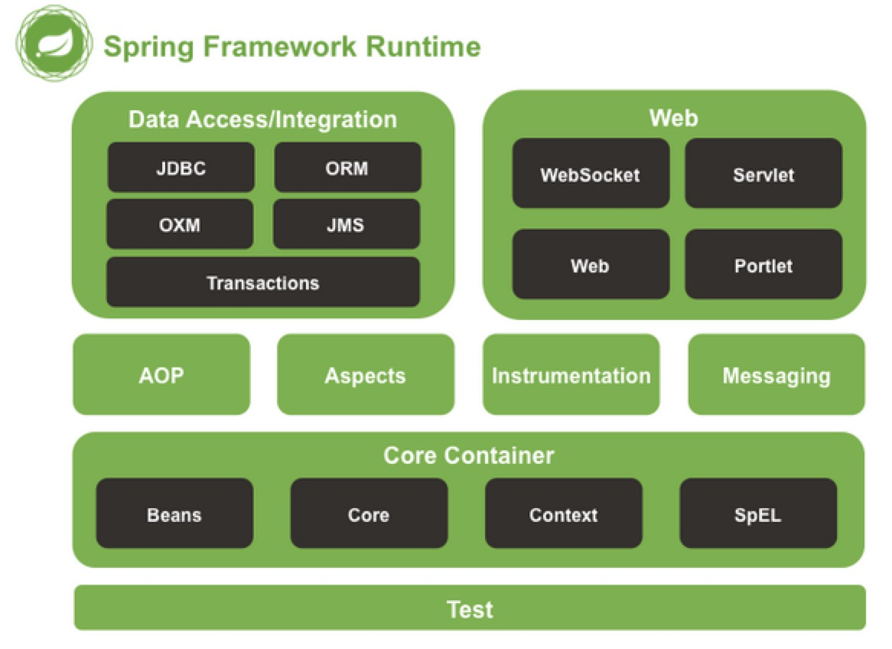
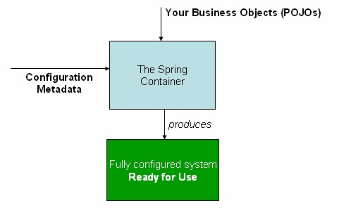
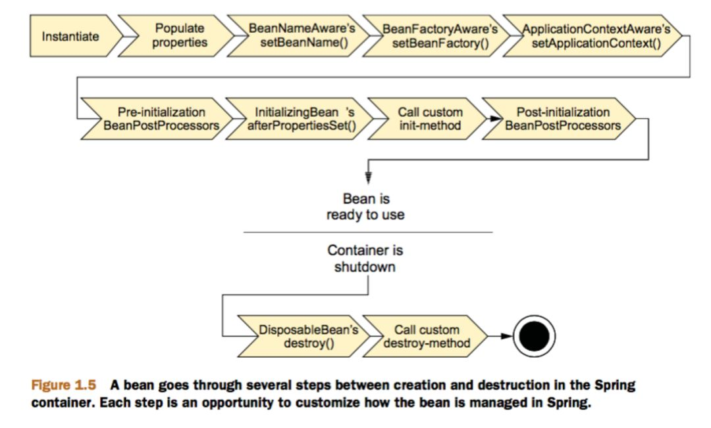
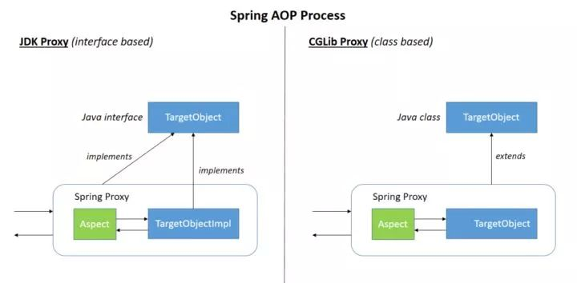

<!-- TOC -->

- [1. Spring官网](#1-spring官网)
- [2. Spring Bean](#2-spring-bean)
- [3. Spring IOC](#3-spring-ioc)
    - [3.1. 概述](#31-概述)
    - [3.2. BeanFactory](#32-beanfactory)
    - [3.3. ApplicationContext](#33-applicationcontext)
    - [3.4. Bean](#34-bean)
        - [3.4.1. Bean定义](#341-bean定义)
        - [3.4.2. Bean作用域](#342-bean作用域)
        - [3.4.3. Bean生命周期](#343-bean生命周期)
        - [3.4.4. 初始化回调](#344-初始化回调)
            - [3.4.4.1. @PostConstruct](#3441-postconstruct)
            - [3.4.4.2. InitializingBean](#3442-initializingbean)
            - [3.4.4.3. init-method](#3443-init-method)
        - [3.4.5. 销毁回调](#345-销毁回调)
            - [3.4.5.1. DisposableBean](#3451-disposablebean)
            - [3.4.5.2. destroy-method](#3452-destroy-method)
        - [3.4.6. 默认init和destroy回调](#346-默认init和destroy回调)
        - [3.4.7. Bean后置处理器](#347-bean后置处理器)
        - [3.4.8. Bean继承](#348-bean继承)
    - [3.5. Bean自动装配](#35-bean自动装配)
    - [3.6. Bean配置方法](#36-bean配置方法)
        - [3.6.1. XML配置](#361-xml配置)
        - [3.6.2. Java代码配置](#362-java代码配置)
    - [3.7. Spring几种依赖注入方式](#37-spring几种依赖注入方式)
        - [3.7.1. setter](#371-setter)
        - [3.7.2. 构造器](#372-构造器)
        - [3.7.3. 静态工厂和实例工厂](#373-静态工厂和实例工厂)
    - [3.8. Spring基于注解的配置](#38-spring基于注解的配置)
        - [3.8.1. @Required](#381-required)
        - [3.8.2. @Autowired](#382-autowired)
        - [3.8.3. @Qualifier](#383-qualifier)
        - [3.8.4. @Primary](#384-primary)
        - [3.8.5. @Resource](#385-resource)
        - [3.8.6. @Value](#386-value)
        - [3.8.7. @PostConstruct](#387-postconstruct)
        - [3.8.8. @PreDestroy](#388-predestroy)
        - [3.8.9. @Configuration](#389-configuration)
        - [3.8.10. @Bean](#3810-bean)
        - [3.8.11. @Scope](#3811-scope)
        - [3.8.12. @Component](#3812-component)
            - [3.8.12.1. @Service](#38121-service)
            - [3.8.12.2. @Controller](#38122-controller)
            - [3.8.12.3. @Repository](#38123-repository)
    - [3.9. Spring如何解决循环引用](#39-spring如何解决循环引用)
        - [3.9.1. 什么是循环引用](#391-什么是循环引用)
        - [3.9.2. 如何解决](#392-如何解决)
    - [3.10.](#310)
            - [3.10.0.1. 构造器循环依赖](#31001-构造器循环依赖)
            - [3.10.0.2. setter循环依赖](#31002-setter循环依赖)
- [4. Spring AOP](#4-spring-aop)
    - [4.1. AOP代理](#41-aop代理)
    - [4.2. 使用@AspectJ](#42-使用aspectj)
    - [4.3. 使用XML](#43-使用xml)
    - [4.4. Spring AOP与AspectJ AOP](#44-spring-aop与aspectj-aop)
- [Spring中用到了哪些设计模式](#spring中用到了哪些设计模式)
- [5. Spring事务管理](#5-spring事务管理)
- [6. Spring MVC](#6-spring-mvc)
    - [6.1. 什么是MVC](#61-什么是mvc)
- [7. Spring JDBC框架](#7-spring-jdbc框架)
- [8. SpringBoot](#8-springboot)
- [9. Spring Cloud](#9-spring-cloud)

<!-- /TOC -->
# 1. Spring官网
[spring.io](https://spring.io/)

[spring-framework-reference](https://docs.spring.io/spring-framework/docs/current/spring-framework-reference/core.html)

[Spring API doc](https://docs.spring.io/spring/docs/5.2.3.RELEASE/javadoc-api/)



# 2. Spring Bean

# 3. Spring IOC
[spring-ioc](https://javadoop.com/post/spring-ioc)
## 3.1. 概述
- IOC: 就是对象之间的依赖关系由容器来创建。对象之间的关系本来是由我们开发者自己创建和维护的，在我们使用Spring框架后，对象之间的关系由容器来创建和维护，将开发者做的事让容器做，这就是控制反转。BeanFactory接口是Spring Ioc容器的核心接口。
- DI:依赖注入，我们在使用Spring容器的时候，容器通过调用set方法或者是构造器来建立对象之间的依赖关系。

Spring提供了两种不同类型的容器
- BeanFactory
- ApplicationContext


## 3.2. BeanFactory
BeanFactory，从名字上也很好理解，生产 bean 的工厂，它负责生产和管理各个 Bean 实例。

在 Spring 中，有大量对 BeanFactory 接口的实现。其中，最常被使用的是 XmlBeanFactory 类。这个容器从XML文件中读取配置Spring元数据。

## 3.3. ApplicationContext
Application Context 是 BeanFactory 的子接口，也被成为 Spring 上下文。

常被使用的ApplicationContext接口实现：
- FileSystemXMLApplicationContext
- ClassPathXMLApplicationContext
- WebXMLApplicationContext

## 3.4. Bean
### 3.4.1. Bean定义
bean 是一个被实例化，组装，并通过 Spring IoC 容器所管理的对象。由XML或Java注解、代码配置创建的。

在Spring容器中，Bean可以认为是BeanDefinition定义的对象。

### 3.4.2. Bean作用域
- prototype 每次调用Bean时返回一个新的实例
- singleton Bean以单例方式存在
- request 每次http请求会创建一个新的Bean，仅适用于WebApplicationContext
- session 同一个http session共享一个bean，不同session使用不同的bena，仅适用于WebApplicationContext
### 3.4.3. Bean生命周期
Bean生命周期可以分为以下：
- 根据Bean配置定义
- Bean初始化
- Bean装载到容器中
- 使用Bean
- 销毁Bean




### 3.4.4. 初始化回调
通常会使用JSR-250中的 @PostConstruct和@PreDestroy注解
#### 3.4.4.1. @PostConstruct

#### 3.4.4.2. InitializingBean
实现InitializingBean接口
```
void afterPropertiesSet() throws Exception;
```

不推荐，会耦合Spring代码
#### 3.4.4.3. init-method
XML配置或者@Bean注解
```
<bean id="exampleInitBean" class="examples.ExampleBean" init-method="init"/>
```
```
public class ExampleBean {

    public void init() {
        // do some initialization work
    }
}
```
### 3.4.5. 销毁回调
#### 3.4.5.1. DisposableBean
```
void destroy() throws Exception;
```
#### 3.4.5.2. destroy-method
### 3.4.6. 默认init和destroy回调
```
<beans default-init-method="init">

    <bean id="blogService" class="com.something.DefaultBlogService">
        <property name="blogDao" ref="blogDao" />
    </bean>

</beans>
```
### 3.4.7. Bean后置处理器
BeanPostProcessor
### 3.4.8. Bean继承

## 3.5. Bean自动装配
- byName
- byType
## 3.6. Bean配置方法
### 3.6.1. XML配置

### 3.6.2. Java代码配置
SpringBoot采用注解配置
## 3.7. Spring几种依赖注入方式
### 3.7.1. setter
### 3.7.2. 构造器
### 3.7.3. 静态工厂和实例工厂

## 3.8. Spring基于注解的配置
### 3.8.1. @Required
被用于Bean的setter方法

Spring Framework 5.1之后被废弃了
### 3.8.2. @Autowired
自动装配,byType方式
- 成员变量
- setter方法
- 构造方法

### 3.8.3. @Qualifier
*TODO*
### 3.8.4. @Primary
*TODO*
### 3.8.5. @Resource
JSR-250，byName自动装配方式
### 3.8.6. @Value

### 3.8.7. @PostConstruct

### 3.8.8. @PreDestroy

### 3.8.9. @Configuration

### 3.8.10. @Bean
@Bean注解作用于方法

### 3.8.11. @Scope

### 3.8.12. @Component
@Component注解作用于类
#### 3.8.12.1. @Service
#### 3.8.12.2. @Controller
#### 3.8.12.3. @Repository

## 3.9. Spring如何解决循环引用
### 3.9.1. 什么是循环引用
一个类A引用类B,而B又引用A,导致两个类互相引用。
### 3.9.2. 如何解决
[](https://www.jianshu.com/p/8b2d4c941d14)
## 3.10. #
#### 3.10.0.1. 构造器循环依赖
无法解决，会抛出BeanCurrentlyInCreationException
#### 3.10.0.2. setter循环依赖
对于setter注入造成的依赖是通过Spring容器提前暴露刚完成构造器注入但未完成其他步骤（如setter注入）的bean来完成的，而且只能解决单例作用域的bean循环依赖。

在创建Bean时，getSingleton这个方法,首先会读取singletonObjects**缓存**中的实例,如果存在则直接返回。因为当我们实例化完成的时候,会通过addSingleton加入到缓存,所以循环依赖注入的时候不会重新加载一遍,只是从缓存中直接读取，所以不会有循环引用的问题。

# 4. Spring AOP
面向切面编程框架，独立于应用程序的业务逻辑，比如日志、事务、安全和缓存等。

Spring AOP 模块提供拦截器来拦截一个应用程序，例如，当执行一个方法时，你可以在方法执行之前或之后添加额外的功能。

```
通过代理模式为目标对象生产代理对象，并将横切逻辑插入到目标方法执行的前后。
```
[Spring AOP源码分析](http://www.tianxiaobo.com/2018/06/17/Spring-AOP-%E6%BA%90%E7%A0%81%E5%88%86%E6%9E%90%E7%B3%BB%E5%88%97%E6%96%87%E7%AB%A0%E5%AF%BC%E8%AF%BB/)

## 4.1. AOP代理
基于动态代理
- JDK动态代理，要代理的对象实现了某个接口，使用JDK动态代理去创建对象。
- CGLIB代理，没有实现接口的对象，使用CGLIB动态代理生成一个被代理对象的子类来作为代理。



JDK动态代理和CGLIB对比：
- 1、CGLib所创建的动态代理对象在实际运行时候的性能要比JDK动态代理高不少，有研究表明，大概要高10倍；

- 2、但是CGLib在创建对象的时候所花费的时间却比JDK动态代理要多很多，有研究表明，大概有8倍的差距；

- 3、因此，对于singleton的代理对象或者具有实例池的代理，因为无需频繁的创建代理对象，所以比较适合采用CGLib动态代理，反正，则比较适用JDK动态代理。

## 4.2. 使用@AspectJ
```
@Configuration
@EnableAspectJAutoProxy
public class AppConfig {

}
```
或者使用xml
```
<aop:aspectj-autoproxy/>
```

## 4.3. 使用XML
```
<aop:config>
```

## 4.4. Spring AOP与AspectJ AOP
- Spring AOP: 运行时增强，基于动态代理，集成了AspectJ
- AspectJ：编译时增强，基于字节码操作

# Spring中用到了哪些设计模式
- 1.工厂设计模式：Spring使用工厂模式通过BeanFactory和ApplicationContext创建bean对象。

- 2.代理设计模式：Spring AOP功能的实现。

- 3.单例设计模式：Spring中的bean默认都是单例的。

- 4.模板方法模式：Spring中的jdbcTemplate、hibernateTemplate等以Template结尾的对数据库操作的类，它们就使用到了模板模式。

- 5.包装器设计模式：我们的项目需要连接多个数据库，而且不同的客户在每次访问中根据需要会去访问不同的数据库。这种模式让我们可以根据客户的需求能够动态切换不同的数据源。

- 6.观察者模式：Spring事件驱动模型就是观察者模式很经典的一个应用。

- 7.适配器模式：Spring AOP的增强或通知（Advice）使用到了适配器模式、Spring MVC中也是用到了适配器模式适配Controller。

。。。

# 5. Spring事务管理

# 6. Spring MVC
## 6.1. 什么是MVC

# 7. Spring JDBC框架

# 8. SpringBoot

# 9. Spring Cloud
服务发现与注册：Eureka、Zookeeper、Consul

负载均衡：Feign、Spring Cloud Loadbalance

服务配置：Spring Cloud Config

服务限流与熔断：Hystrix

服务链路追踪：Dapper

服务网关、安全、消息
